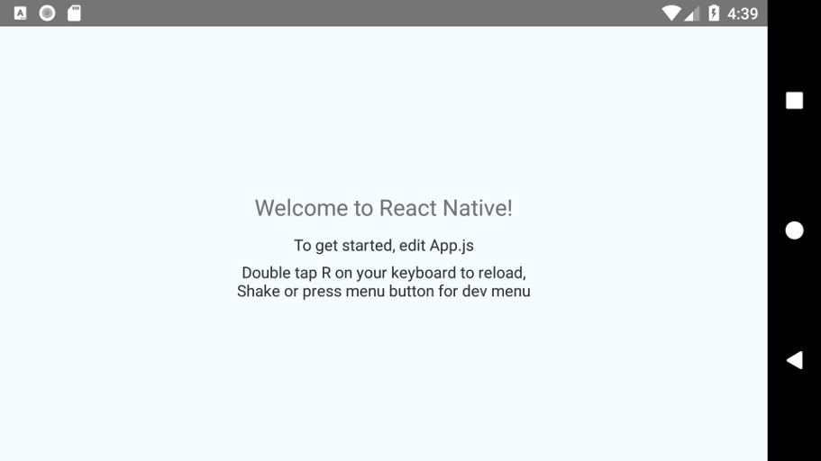

# go-ghostbridge – React Native to Go bridge

Crossing language barriers is hard... really hard!

If you have a React Native mobile UI and would like to call a library method implemented in Go, you theoretically need to cross `JavaScript → Java → C → Go`. Practically – if we add the tech layers too – it's `UI (JavaScript) → Native Modules (JavaScript/Java) → Android (Java) → Native Interface (Java/C) → Shared library (C) → Go wrappers (C/Go) → Library (Go)`.

Although there are amazing tools to help streamline the above, the user is still required to do a lot of manual gluing together. Even with all the effort put into it, every language barrier crossed introduces new restrictions and new performance penalties. At some point, the whole system becomes too brittle to maintain.

The `ghostbridge` project aims to establish a direct line of communication between the frontend and the backend, omitting all the intermediate languages, hooking React Native straight into Go.

*Note, this project is not a silver bullet, it may be overkill or inappropriate for your use case. Before diving in, please consider the rationale behind the creation of `ghostbridge`.*

## The platform model sucks

To put it bluntly, React Native is a glorified website. It may be one of the marvels of the modern world, but under the hood it's still a dumb HTML & JavaScript combo. This makes data processing and data shuffling between UI and device exceedingly hard: JavaScript is simply not suited to directly handle the sheer amount of data a modern application needs.

The solution was the introduction of native modules, where instead of touching the data directly (eg. render a photo), the UI wraps the OS components and delegates the heavy lifting to them instead. This works surprisingly well, as long as the native OS components can short circuit the data between themselves without ever having to enter JavaScript.

Therein lies the problem. For this delicate equilibrium to hold, the underlying components need to be über-optimized and über-aware of each other. That of course holds true for Android components, but things start falling apart when users introduce custom libraries written in languages other than Java. The low level JNI interfaces are fine for simple operations, but tight integration with specialized data pathways is not realistic.

There are two classical ways out: a) developers invest the insane amount of time to create their own tight integration of the library into a Java wrapper that can provide the necessary performance guarantees; b) they surface the library functionality straight into JavaScript and bear the insane performance hit:

 - Option (a) is unrealistic if the library itself is heavily changing.
 - Option (b) is unrealistic if large amounts of data are handled.

## The website model works

As mentioned above, a React Native app is a website. It might have lots of bells and whistles and tight integrations, but at the end of the day, it's core is still a JavaScript website. This website model means, however, that HTTP is its native form of interaction with remote services.

This is an interesting edge: since most React Native applications access data from remote servers via HTTP, the actual protocol implementation is both highly optimized and fairly flexible. Furthermore, since most developers rely on RESTful APIs and CDNs for their remote services, the React Native component ecosystem also evolved around HTTP.

Instead of fighting React Native's mental model, we can embrace it. Instead of exposing a Go library across 4 languages (losing any hope of sanity left), we can convert our library into an HTTP micro-service running on the device itself! Go excels as HTTP anyway, so this seems like a no-brainer.

Of course, I didn't invent the wheel here. Many developers implemented such a communication model before, yet it never really got popular. Turns out, this seemingly simple idea has some painful security implications:

 - If you run an HTTP server on your mobile device, any application – even worse, any webpage running in any browser on the device – can interact with it.
 - If you run an HTTP server on `localhost`, there's no encryption or authentication involved, so malicious applications can eavesdrop or execute man-in-the-middle attacks.

## From prototype to production

Exposing a Go library as an HTTP service seems more like a tech demo than a working product. No serious publisher will permit such glaring security holes in their applications (one can only hope). Can we take this model and make it secure though? Turns out the answer is a resounding yes, but it needs some code-fu.

There are three individual problems that we must solve:

  - The UI must be sure it's talking to the correct service before exchanging any data.
  - The Go library must be sure it's talking to the correct UI before exchanging any data.
  - The participants must establish an encrypted data stream before exchanging any data.

This problem is already solved with real-world remote services: TLS certificates and API tokens. With an HTTP service running on `localhost` however, things beak down again:

 - If you ship a certificate within your app, that authenticates `localhost`, anyone can extract it and impersonate you, since your service is sharing the `localhost` domain with every other app.
 - Without a TLS certificate, we're out of luck. The HTTP protocol was designed around this form of security. If we want to use HTTP, we need to play by its rules.

The key realization here is that a TLS certificate for `localhost` is a perfectly workable solution, as long as **nobody can copy it**. The challenge is not to devise an alternative security protocol, but to devise a way to protect the certificate!

### Ephemeral self-signed certificates

All the drama in the above section was around certificates and the challenge of keeping them a secret, but the best way to keep something a secret, is not to create it in the first place! HTTPS doesn't care who creates a certificate, as long as it can validate it against its trusted chain. Instead of shipping one, we can generate one on the fly!

Our Go library we'd like to expose via HTTP(S) is a fully fledged Go program. As such, it is perfectly capable of not only running its own HTTP server, but also generating a random, one-shot, self-signed TLS certificate for it! Yes,  there's a catch: Go might be happy with its shiny new certificate, but React Native will flat out reject it as untrusted. There are more tools in our shed though!

Although this document advocates that the best form of communication between a Go library and React Native is HTTP(s), the messy platform model/APIs are nonetheless available. Since the Go library is still executing within the context of the Android application, it can also interact with the system and inject the ephemeral certificate into the application's trusted certificate pool!

:boom: Encryption and server authentication solved! :boom:

### Ephemeral authorization tokens

React Native is now well protected against eavesdropping and man-in-the-middle attacks. No data will ever leak out from the UI to a malicious entity. We can't state the same about the Go service yet. With no authentication layer, any application and website can still access it (ignoring the certificate error).

The classical solution with real-world remote services is API tokens. If the connecting client knows a pre-agreed upon secret key, they can use the service. Obtaining this API token is usually done out-of-bounds on some other protocol. We can use this exact same mechanism!

Beside generating the self-signed certificate, the Go library can also generate a random, one-shot access token. As with the certificate, the Go library can use the platform native interfaces (i.e. `Go → C → JNI → Java`) to inject the token into the Android application's HTTP client!

:boom: Client authentication solved! :boom:

### Ephemeral service endpoints

Although all security issues have been addressed, there are still a few practicalities before our service model is complete. Namely, starting a TCP server on `localhost` cannot reliably use the same well defined port: it may be taken by some other program or the OS might be holding it for some reason.

The simplest solution is to let the operating system pick the TCP port for the HTTPS server. That's easy enough, just set the requested port to 0. A changing endpoint, however, means that the React Native UI needs to track which port the service is currently running on, which ruins the simplicity of stable URLs.

We can again abuse the fact that the Go library executes in the same process as the rest of the Android application and hook once more into the app's networking layer. Instead of having to constantly change the URLs on the UI, we can define a meta-endpoint (e.g. `https://ghost-bridge`), which gets silently redirected to the current live real endpoint by an HTTP interceptor!

:boom: Seamless ephemeral endpoints solved! :boom:

## Assemble all the things

**Q: Does the theory make sense?**
*A: Hell yeah!*

**Q: Do you want to implement it?**
*A: Erm...*

I don't blame you. Gluing together all these worlds in a secure way seems like a repetitive, error prone and frustrating experience (at least that's what it was to me). Thus *Ghost Bridge* was born, with the aim of never having to do this again, ever. Ever!

The `ghostbridge` project is an automation layer between **your** Go library and **your** React Native UI, aiming to seamlessly solve all the security and usability challenges whilst, *staying out of the effn way*™.

### Creating the Go-React Native bridge

`ghostbridge` assumes you already have an `http.Handler` that it can secure. Creating this RESTful API for your library is your task. The benefit of requiring an `http.Handler` is that you can unit test your API via the exact same HTTP mechanisms that React Native will call.

For demo purposes, let's hack together an `http.Handler` that generates [`adorable`](github.com/ipsn/go-adorable) avatars:

```go
package avatars

import (
	"net/http"
	"github.com/ipsn/go-adorable"
)

// service is a simple HTTP handler to generate pseudo-random avatars based on
// the requested URL path.
var service = http.HandlerFunc(func(w http.ResponseWriter, r *http.Request) {
	w.Write(adorable.PseudoRandom([]byte(r.URL.Path)))
})
```

We need three things now:

 - Running this `http.Handler` in a secure way described in the first part of this document.
 - Exposing the necessary control mechanisms for Android to manage the Go service.
 - Bundle the whole thing up an an Android  archive to link to the React Native UI.

The `ghostbridge` library takes care of security. It has a `ghostbridge.New(handler http.Handler)` method that wraps a simple Go `http.Handler` into a mutually authenticated and encrypted HTTPS server. It can be started, stopped and its security parameters retrieved.

Although `ghostbridge` also provides the necessary control mechanisms (i.e. functions) on the created `ghostbridge.Bridge` object, `gomobile` does not support bundling up external methods into a bound package. As such, we need a tiny bit of boilerplate to force these methods into our own package:

```go
package avatars

import (
	"net/http"
	"github.com/ipsn/go-adorable"
	"github.com/ipsn/go-ghostbridge"
)

// service is a simple HTTP handler to generate pseudo-random avatars based on
// the requested URL path.
var service = http.HandlerFunc(func(w http.ResponseWriter, r *http.Request) {
	w.Write(adorable.PseudoRandom([]byte(r.URL.Path)))
})

// Bridge is a tiny struct (re)definition so gomobile will export all the built
// in methods of the underlying ghostbridge.Bridge struct.
type Bridge struct {
	*ghostbridge.Bridge
}

// NewBridge creates an instance of the ghost bridge, typed such as gomobile to
// generate a Bridge constructor out of it.
func NewBridge() (*Bridge, error) {
	bridge, err := ghostbridge.New(service)
	if err != nil {
		return nil, err
	}
	return &Bridge{bridge}, nil
}
```

In essence we're jumping through a few hoops so that the `ghostbridge.Bridge` object we create via `ghostbridge.New` gets converted into a type local to this particular package. `gomobile` will only export local types and methods. The good news is that the above code is just boilerplate, independent of your `http.Handler` implementation, so copy-paste away!

Creating the Android library now boils down to calling a `gomobile bind` on it (I'm running from within the package folder that contains the above file):

```
$ gomobile bind -v -target=android .
[...half a minute later...]

$ ls -l
total 17428
-rw-r--r-- 1 karalabe karalabe 17832115 Mar  2 16:18 avatars.aar
-rw-rw-r-- 1 karalabe karalabe      678 Mar  2 16:18 avatars.go
-rw-r--r-- 1 karalabe karalabe     7050 Mar  2 16:18 avatars-sources.jar
```

If you've never used `gomobile` before, [its wiki pages](https://github.com/golang/go/wiki/Mobile) are a good starting point and [@eliasnaur](https://github.com/eliasnaur) a good followup! :D He's a great guy!

### Linking the Go-React Native bridge

Analogous to our demo Go library, we'll create a new demo React Native UI. First thing's first, let's make a new project and make sure it runs correctly on our Android device or emulator.

```
$ react-native init avatardemo
[... a bit later ...]
To run your app on Android:
   cd /work/src/github.com/ipsn/avatardemo
   Have an Android emulator running (quickest way to get started), or a device connected
   react-native run-android

$ cd avatardemo
$ react-native run-android
[... a bit later ...]
Starting: Intent { cmp=com.avatardemo/.MainActivity }
```

This should get you the stock *welcome* view of React Native.



Let's replace that with our `adorable` avatar! First up, we need to link our `avatars.aar` to the React Native Android project. Although there are fancy ways to hook the Go sources directly into the Gradle build system, we'll add it manually now.

Open your project's Gradle build file `avatardemo/android/build.gradle` and modify its repository section to allow local `.aar` archives. I.e. add the `flatDir` section in the group below:

```groovy
allprojects {
    repositories {
        mavenLocal()
        google()
        jcenter()
        maven {
            url "$rootDir/../node_modules/react-native/android"
        }
        flatDir {
          dirs 'libs'
        }
    }
}
```

Open your application's Gradle build file `avatardemo/android/app/build.gradle` and add a compile time dependency to the generated archive `compile(name:'avatars', ext:'aar')` (add this to the `dependencies { ... }` section).

Lastly copy the generated `avatars.aar` file into `avatardemo/android/app/libs/avatars.aar`. After all said and done, you should be able to rebuild your Android application and have the Go code linked:

```
$ react-native run-android
[... a bit later ...]
Starting: Intent { cmp=com.avatardemo/.MainActivity }
```

### Running the Go-React Native bridge

Linking the Go library to the React Native didn't do much. We need to actually start the thing! We could attempt some auto-magic startup on library load, but the app developer is better suited to decide when to run the Go service and where (background thread, foreground thread, activity thread).

Since this is a demo, we won't make it fancy: let's just start it when the application itself starts. Edit your `MainApplication.java` file to import the bridge (`import avatars.Bridge;`) and to start it in `onCreate`:

```java
try {
    Bridge bridge = new Bridge();
} catch (Exception e) {
    e.printStackTrace();
}
```

Unfortunately `gomobile` is unable to completely expose the Android certificate APIs to Go, so for now, instead of the Go bridge injecting the security configurations auto-magically into Android, we'll delegate that to a Ghost Bridge java utility class. This may change in the future, but requires a bit of work on `gomobile`.

Please copy the [`GhostBridge.java`](./android/GhostBridge.java) file from this repository into your app's source folder. You can import it in your `MainApplication.java` via `import io.ipsn.ghostbridge.GhostBridge;` and modify the bridge creation to initialize the Android side of the crypto bridge:

```java
try {
    Bridge bridge = new Bridge();
    GhostBridge.init(bridge.port(), bridge.cert(), bridge.token());
} catch (Exception e) {
    e.printStackTrace();
}
```

Finally, redeploy everything and verify that it all still builds:

```
$ react-native run-android
[... a bit later ...]
Starting: Intent { cmp=com.avatardemo/.MainActivity }
```

### Demo the Go-React Native bridge

Everything works in theory. But in practice? Let's find out! Modify your `avatardemo/App.js` React Native UI file so it also imports `Image` from `react-native`, and replace the boring welcome message with:

```js
<Text style={styles.welcome}>Welcome to Ghost Bridge!</Text>
<Image
  style={{width: 256, height: 256}}
  source={{uri: 'https://ghost-bridge/avatar.png'}}
/>
```

Moment of truth... refresh your app (double press `R` on your keyboard)...


:boom: Seamless, mutually-authenticated, encrypted bridge! :boom:

## Explaining the magic

Wow, it worked! That said, `https://ghost-bridge/avatar.png` is one magical URL. Let's break it down into it's components to see what goes on under the hood.

 - `ghost-bridge` is obviously a non existent domain (it doesn't even have a TLD). When we initialized the Ghost Bridge via the Java utility, it inserted an interceptor into React Native's `okhttp3` library. Whenever React Native makes an HTTP request, the interceptor redirects the `ghost-bridge` domain to the Go service running on `localhost`.
 - `https:\\` requires a valid, trusted TLS certificate, which we obviously don't have. When the Ghost bridge initializes itself, it retrieves the randomly generated new certificate and injects it into the app's `TrustManager`, which is then injected into React Native's socket factory.
 - Client authentication requires an API token, which we obviously didn't specify. Ghost Bridge is again to blame: during initialization it injects another interceptor into `okhttp3`, which adds an `Authorization: Bearer` header every HTTP request sent to the `ghost-bridge` domain.

The end result is that React Native remains completely oblivious to the fact that it's actually talking to a local library and also remains oblivious to the seamless encryption and mutual authorization. *Everything just works*™.

## Credits

This repository is maintained by Péter Szilágyi ([@karalabe](https://github.com/karalabe)).

## License

3-Clause BSD.
